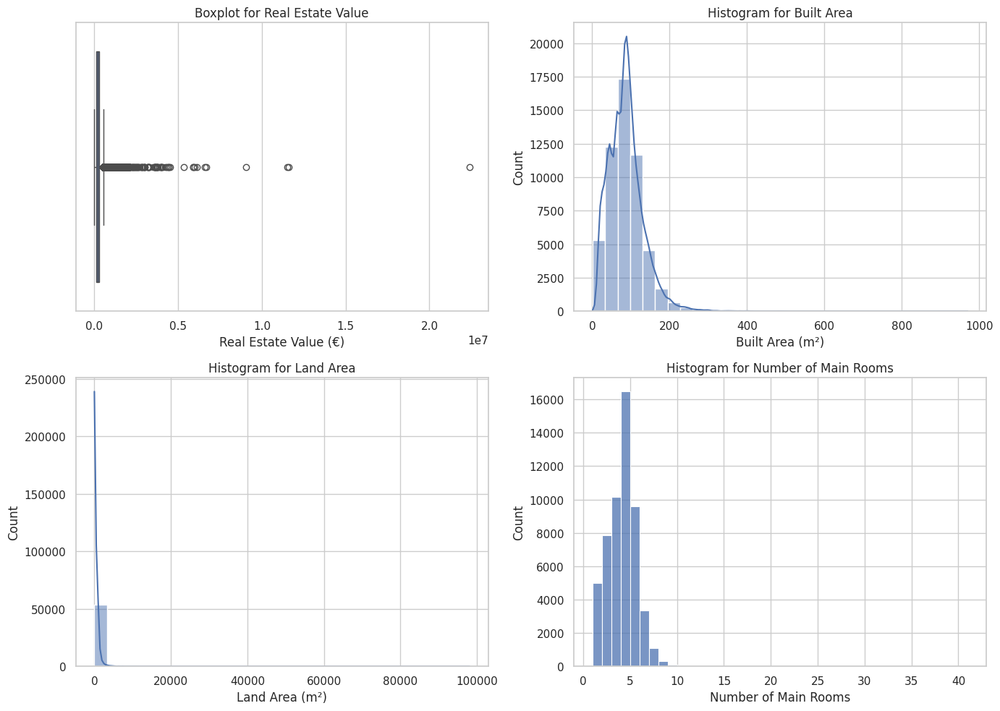
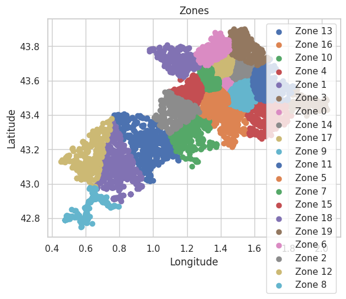
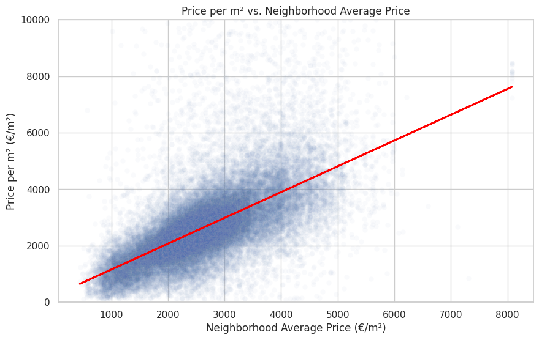

Projet d'Evaluation Immobilière en Haute-Garonne - README
=========================================================

Introduction
------------

Le réseau d'agences immobilières historique en Haute Garonne se trouve face à un défi : moderniser ses méthodes d'évaluation de biens immobiliers pour rester compétitif dans une ère de digitalisation. Le gouvernement a récemment mis à disposition des données de valeurs foncières en open data, offrant une opportunité d'innover en intégrant des analyses de données dans le processus d'évaluation.

Objectif
--------

L'objectif de ce projet est de développer un outil qui utilise les données ouvertes pour estimer la valeur de vente des propriétés basée sur leurs caractéristiques, dépassant ainsi les estimations traditionnelles basées sur des règles métiers et l'expérience des agents.

Aperçu des Données
------------------

Les données comprennent des informations internes de l'agence (`agence.csv`), des données démographiques et économiques par commune (`insee_commune_15.csv`), une correspondance entre codes postaux et INSEE (`localisation_commune.csv`), et des données de valeurs foncières nationales (`france.csv`). Un nettoyage préliminaire a été effectué pour traiter les valeurs manquantes et les erreurs.

Analyse Exploratoire des Données (EDA)
--------------------------------------

Les analyses ont révélé une grande variabilité des prix, une distribution concentrée de la surface bâtie et du nombre de pièces principales. Les visualisations incluent des histogrammes, des graphiques de dispersion et des matrices de corrélation, soulignant l'importance de l'emplacement et des caractéristiques physiques des biens.

*   **Boxplot pour la valeur immobilière**: Ce graphique montre la distribution de la valeur immobilière avec une médiane basse et plusieurs valeurs aberrantes extrêmes, ce qui indique une large variation des prix sur le marché immobilier. Cela pourrait signifier que des facteurs supplémentaires non représentés dans ce graphique influencent les prix.
    
*   **Histogramme pour la surface bâtie**: La distribution de la surface bâtie des propriétés est principalement concentrée dans les gammes inférieures avec une longue queue à droite, suggérant que la plupart des propriétés ont une surface modeste avec quelques propriétés beaucoup plus grandes.
    
*   **Histogramme pour le nombre de pièces principales**: La majorité des propriétés ont un nombre de pièces allant de 1 à 10, avec un pic net pour les propriétés ayant 4 ou 5 pièces, ce qui est typique pour les maisons et appartements familiaux.
    
*   **Prix au m² vs. Prix moyen du quartier**: Ce graphique montre une corrélation positive entre le prix au m² d'un bien et le prix moyen par m² dans le quartier. Cela indique que le prix d'un bien est fortement influencé par l'emplacement et que les propriétés sont généralement évaluées en fonction de l'économie locale du marché immobilier.

Ingénierie des Caractéristiques
-------------------------------

1.  **Détermination du "Prix du voisinage"** : La première étape consiste à calculer pour chaque bien la moyenne des prix au m² des biens les plus proches. Cette mesure, qui reflète le jugement initial d'un agent immobilier, est cruciale pour l'estimation précise d'un bien.
    
2.  **Calcul de la distance d'Haversine** : Au lieu de calculer une distance euclidienne classique, la distance d'Haversine est utilisée, car elle tient compte de la courbure de la Terre, ce qui la rend adaptée pour calculer les distances entre des points définis par leurs latitudes et longitudes.
    
3.  **Optimisation des calculs de distance** : Plutôt que de calculer la distance entre chaque paire de biens dans tout le dataset, ce qui serait prohibitif en termes de calcul, l'algorithme de partitionnement spatial BallTree est utilisé. Ce modèle peut rapidement trouver les biens les plus proches pour un bien donné une fois qu'il a été entraîné sur les données.
    
4.  **Fragmentation géographique et modèles BallTree par région** : Pour optimiser davantage et éviter les problèmes de biens situés aux frontières géographiques, plutôt que de créer un unique modèle BallTree pour toutes les données, un modèle est créé pour chaque chaque zone (déterminée par KMeans). Cela permet de réduire le nombre de calculs et de fournir des estimations plus précises pour le "prix moyen du voisinage".
    
5.  **Création et utilisation des modèles BallTree** : Les modèles BallTree sont créés pour chaque région (ou zone), et ensuite utilisés pour chaque bien afin de calculer la distance moyenne et le prix moyen au m² des 10 biens les plus proches.
    

L'implémentation fournie montre comment les modèles BallTree sont créés et utilisés pour enrichir les données avec le "prix moyen du quartier" et la "distance moyenne" pour chaque bien. L'algorithme BallTree, avec la métrique Haversine, calcule les distances et les indices des biens voisins, et ces informations sont utilisées pour calculer les nouvelles caractéristiques. Ces dernières sont ensuite enregistrées dans le dataset, améliorant ainsi la richesse des données disponibles pour la modélisation prédictive.

*   **Corrélation positive** : Il y a une corrélation positive évidente entre le prix au m² d'un bien et le prix moyen au m² dans le voisinage. Cela suggère que si un bien est situé dans une zone où le prix moyen au m² est élevé, il est probable que le prix au m² de ce bien soit également élevé.
    
*   **Concentration des données** : La majorité des points de données semblent être concentrés dans les gammes inférieures de prix tant individuels que de voisinage, ce qui est typique car la plupart des biens résidentiels se situent dans des zones de prix moyens plutôt que dans des zones extrêmement chères ou bon marché.
    
*   **Dispersion des données** : Alors que de nombreux points se conforment à la tendance, il y a également une dispersion notable, indiquant des exceptions où le prix d'un bien peut dévier de celui attendu en fonction du voisinage. Ces exceptions pourraient être dues à des caractéristiques uniques des biens ou à des erreurs dans les données.
    
*   **Valeurs extrêmes** : Il y a quelques points de données avec des prix au m² très élevés qui ne correspondent pas à la tendance générale. Ces valeurs extrêmes pourraient représenter des propriétés de luxe ou des erreurs de saisie de données.

Sélection et Évaluation des Modèles
-----------------------------------

Pour évaluer la capacité de prédire le prix au mètre carré des biens immobiliers en Haute-Garonne, nous avons mis en place et comparé trois modèles différents : la Régression Linéaire, la Forêt Aléatoire (Random Forest) et le Gradient Boosting. Ces modèles ont été choisis pour leur capacité à traiter des caractéristiques numériques et catégorielles, ainsi que pour leur performance généralement reconnue sur des tâches de régression.

Chaque modèle a été évalué sur la base du Mean Absolute Percentage Error (MAPE), qui mesure l'erreur en pourcentage entre les valeurs prédites et les valeurs réelles. Voici les performances obtenues sur l'ensemble de test :

*   **Régression Linéaire :** MAPE de 29.17%
*   **Forêt Aléatoire :** MAPE de 28.40%
*   **Gradient Boosting :** MAPE de 28.74%

Ces résultats suggèrent que tous les modèles ont des performances comparables, avec la Forêt Aléatoire légèrement en avance sur les autres. Cependant, toutes les erreurs sont relativement élevées, ce qui indique une marge d'amélioration pour la prédiction des prix immobiliers.

La sélection des caractéristiques pour les modèles comprenait des variables telles que le type de local (type de bien), la surface réelle bâtie, les coordonnées radiales (latitude et longitude), la zone définie par KMeans, la distance moyenne du voisinage, le prix moyen du voisinage, et le nombre de pièces principales. Les variables catégorielles telles que le type de local ont été encodées en utilisant la technique de one-hot encoding, qui transforme les variables catégorielles en une série de variables binaires, permettant ainsi aux modèles de machine learning de les traiter efficacement.

L'ensemble des caractéristiques utilisées pour la prédiction a été sélectionné pour leur pertinence théorique et leur performance observée lors de l'exploration des données. La Forêt Aléatoire et le Gradient Boosting, en particulier, bénéficient de cette sélection de caractéristiques en raison de leur capacité à modéliser des interactions complexes et des non-linéarités dans les données.

En conclusion, bien que la Forêt Aléatoire ait montré les meilleures performances parmi les modèles testés, il reste un potentiel d'amélioration. Des efforts supplémentaires dans l'ajustement des modèles, l'intégration de nouvelles données, et l'expérimentation avec différentes techniques d'ingénierie des caractéristiques pourraient contribuer à améliorer la précision des prédictions de prix au mètre carré.

Résultats de la Preuve de Concept
---------------------------------

L'objectif principal de notre preuve de concept (POC) était d'évaluer la viabilité d'une approche basée sur les données pour estimer les prix immobiliers en Haute-Garonne. Notre approche a utilisé des modèles de machine learning pour prédire les prix au mètre carré en se basant sur les caractéristiques des biens et de leur environnement.

### Performances du Meilleur Modèle

Après avoir testé différents modèles et paramètres, le modèle de Forêt Aléatoire (RandomForest) s'est avéré être le plus performant, avec des paramètres optimaux comprenant 200 arbres (`n_estimators`), un `min_samples_split` de 5, un `min_samples_leaf` de 2, une profondeur maximale (`max_depth`) de 10, et l'utilisation de `bootstrap`. Voici les métriques clés pour ce modèle :

*   **Mean Absolute Error (MAE)** : 544.7432532418653
*   **Root Mean Squared Error (RMSE)** : 859.1863590207544
*   **R-squared (R²)** : 0.48539963955762333
*   **Mean Absolute Percentage Error (MAPE)** : 28.50%

Ces métriques révèlent la capacité du modèle à prédire avec une erreur absolue moyenne d'environ 544.74 euros, ce qui est significatif mais indique tout de même une capacité raisonnable de prédiction compte tenu de la grande variabilité des prix immobiliers. Le RMSE légèrement plus élevé suggère que des erreurs plus importantes existent pour certaines prédictions, potentiellement dues à des valeurs aberrantes ou à des propriétés avec des caractéristiques atypiques.

Le coefficient de détermination (R²) à 0.485 indique que près de la moitié de la variabilité des prix peut être expliquée par le modèle. Bien que cela montre que le modèle a une pertinence certaine, il reste une part importante de la variabilité qui n'est pas capturée, ce qui laisse place à des améliorations.

### Évaluation par Validation Croisée

La validation croisée a été utilisée pour évaluer la stabilité de notre modèle. Les résultats montrent une moyenne du MAE de 547.222 avec un écart-type de 2.247, et une moyenne du R² de 0.475 avec un écart-type de 0.012. Ces résultats sont cohérents avec les performances du modèle sur l'ensemble de test et indiquent que notre modèle est relativement stable et ne souffre pas de surajustement.

### Conclusion de la POC

Les résultats de la POC démontrent que l'approche basée sur les données peut fournir des estimations de prix raisonnables et surpasser les méthodes traditionnelles basées sur les règles et l'expérience dans certains cas. Toutefois, avec un MAPE d'environ 28.50%, il est clair que le modèle pourrait être amélioré. Les erreurs pourraient être réduites en intégrant plus de données pertinentes, en affinant davantage les modèles, ou en explorant de nouvelles techniques d'ingénierie des caractéristiques.

Ces résultats forment une base solide pour la poursuite du développement d'outils d'estimation immobilière. Le potentiel d'amélioration est significatif, et les prochaines étapes consisteront à explorer ces voies pour affiner notre outil et fournir aux agents immobiliers une solution robuste et fiable pour évaluer les propriétés.

Recommandations et Prochaines Étapes
------------------------------------

Il est recommandé d'intégrer progressivement le modèle dans le workflow actuel, en commençant par des tests en parallèle avec les méthodes existantes. Des améliorations potentielles pourraient inclure l'ajout de données plus granulaires et l'optimisation des modèles.

Conclusion
----------

Ce projet démontre le potentiel d'une approche basée sur les données pour compléter et améliorer l'expertise des agents immobiliers, offrant une méthode d'évaluation plus objective et précise qui peut aider l'entreprise à rester compétitive.